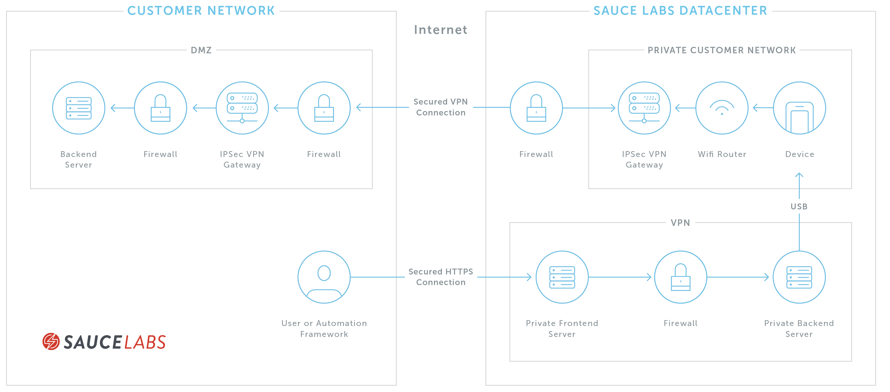

<p><button class="badge-blue">ENTERPRISE PLANS ONLY</button></p>

See [Sauce Labs Cookbook: IPSec VPN](https://wiki.saucelabs.com/pages/viewpage.action?pageId=76419359) for information on how to integrate IPSec VPN tunnels with your testing.

Internet Protocol Security VPN (IPSec VPN) is a technology that connects two private networks securely over the public Internet. Sauce Labs offers a IPSec VPN solution that enables secure connections between applications hosted on a private network or local machine, and the Sauce Labs cloud. Topics in this section cover architecture, setup information, and troubleshooting tips.

To get started, you'll need to contact your Sauce Labs Sales Engineer or Customer Success Manager, who will guide you through the IPSec tunnel setup and configuration. Once you're up and running with your tunnel, you'll be able to connect to both virtual cloud devices and real devices.

## Architecture and Security

IPSec VPN allows virtual machines on the Sauce Labs network to access application servers on private networks. The solution consists of a VPN connection and two IPSec tunnel gateways, one running on the customer network, and the other on Sauce Labs. This connection allows secure communication between the gateways, which provide rules for DNS resolution, routing, and security.




### Security
We recommend using an enterprise-grade gateway for your IPSec configuration. The tunnel gateway runs a firewall, through which only authorized virtual machines may connect.

By default, all VM connections are blocked. The firewall rules are dynamically adjusted to allow connections from new authorized VMs, and block connections from terminated test VMs.

Authorized test VMs include:

* VMs created by the IPSec VPN tunnel owner
* VMs created by accounts with which the tunnel is shared **insert anchor link to tunnel sharing section**
By default, the firewall allows the following ports and protocols through the IPSec VPN connection:

| Directions | Protocols |
| :-------------------------- | :---
| Outbound from Sauce | HTTP (TCP/80), HTTPS (TCP/443)
| Outbound from Sauce | DNS (UDP/53, TCP/53, TCP/853)
| Outbound from Sauce | Web Proxy (TCP/8080, TCP/8443)
| Inbound from customer network, Outbound | ICMP
| Inbound from customer network | BGP (TCP/179)

You can request additional ports and protocols to be opened by contacting Sauce Labs Support.

### Routing
Test VMs using the IPSec VPN tunnel will route all their test traffic to the tunnel gateway. The tunnel gateway routes all predefined customer subnets through the IPSec VPN tunnel. All other traffic is routed to the Internet.

The tunnel gateway can be configured with the options `tunnel-domains` and `direct-domains`. Both are mutually exclusive, and provide a list of domain names. The tunnel gateway routes any requests matching `tunnel-domains` through the IPSec VPN tunnel, and any requests that match `direct-domains` directly to the Internet.

Order of precedence is as follows:

1. Route based on tunnel-domains and direct-domains
1. Route based on customer subnets.

We strongly recommend using subnets for routing.

#### Routing Rules
Tunnel gateways use predefined static routes by default. If you are running a BGP server, the tunnel gateway can learn about new routes on the customer network. Please contact [Sauce Labs Support](https://saucelabs.com/training-support) to update static routes.

### DNS Resolution
Requests for predefined user domains are forwarded to the user's DNS servers. All other requests are resolved through public DNS servers.

### Protocols
Sauce Labs IPSec VPN supports HTTP, HTTPS, DNS, WebSockets and Secure WebSockets.

### Self-Signed Certificates
The tunnel gateway acts as a man-in-the-middle proxy, re-encrypting all SSL connections with Sauce Labs certificate by default. If your tests don't require access to servers with self-signed certificates, we strongly recommended disabling SSL re-encryption.

SSL re-encryption can be disabled for all domains or selected domains with `no-ssl-bump-domains`.

WebSocket servers with self-signed certificates are not supported.

### Security Settings
See [Security Settings for Organizations](https://wiki.saucelabs.com/pages/viewpage.action?pageId=69108863).


## Network Requirements

We recommend the following as general guidelines:

| Number of Concurrent Sessions | Recommended Number of IPSec Tunnels | Recommended Total Bandwidth
| :-------------------------- | :--- | :---
| 20 | 1 | 50Mbps
| 100 | 1 | 250Mbps
| 500 | 2 | 750Mbps
| 1,000 | 2 | 1.5Gbps
| 2,000 | 2 | 3Gbps

Bandwidth requirements for testing depend on the number of pages downloaded by each test, and the approximate size of each page. To estimate your requirements, we recommend running 25-40 concurrent sessions through a proxy while observing network usage patterns. You should have enough bandwidth to download a page in 3 to 5 seconds.

## Using IPSec VPN Tunnels

Our IPSec VPN solution provides your organization with a single, static tunnel, through which you can run manual and automated tests securely on Sauce Labs virtual and real devices.

### What You'll Need

<p><button class="badge-blue">ENTERPRISE PLANS ONLY</button></p>

* Your organization's VPN client parameters must be configured with the Sauce Labs VPN. This must be done by our support team.
* Authorization to use your organization's IPSec VPN tunnel. For more info, see Sharing IPSec VPN Tunnels.
* Review IPSec VPN Network Requirements to ensure that your tunnel can support your desired number of concurrent sessions.
* Your organization admin's name.
* Your organization's IPSec VPN tunnel name.

### Launching Tests Through IPSec VPN Tunnels
You can set an IPSec VPN tunnel connection for both manual and automated tests. Depending on the type of test you want to run, you may need to include certain desired capabilities in your test script.

#### Automated Testing
To connect to Sauce Labs real devices and virtual devices, assign your IPSec VPN tunnel to the appropriate Data Center Endpoint in your test script.

##### Appium and Selenium
Set the tunnelIdentifier desired capability to the name of your organization's IPSec VPN tunnel
Set the parentTunnel capability to the username of your Organization Admin
For example, let's say the name of your tunnel is AwesomeTunnel and your Organization Admin's username is john.smith. Here's how you'd define it in Java:

```sh
MutableCapabilities caps = new MutableCapabilities();
caps.setCapability("tunnelIdentifier", "AwesomeTunnel");
caps.setCapability("parentTunnel","johnsmith");
```

##### Espresso Tests on Emulators
Set the tunnel-identifier argument for Sauce-Runner-Virtual to the name of your IPSec VPN tunnel.

#### Live Testing
For Cross-Browser app testing, head to Live > Cross-Browser > Click Sauce Connect Proxy dropdown > Select your IPSec VPN tunnel.

For mobile device testing, to Live > Mobile-App > Choose your app from the list > Click Sauce Connect Proxy dropdown > Select your IPSec VPN tunnel.

### Note About Public Real Devices
To ensure compliance with your company's settings and network policy, we recommend checking with your organization admin before running tests on virtual and real devices over an IPSec VPN connection.

To run tests on public real devices in the Sauce Labs cloud using IPSec VPN, your organization admin must switch on Enable Sauce Connect Proxy/IPSec VPN for Public Cloud Devices, a security setting that is disabled by default. Once the setting is enabled, all users across your organization can run live and automated tests on public devices over IPSec VPN. Each time you initiate a test, you'll see a temporary pop-up alert window with a reminder that the utilization of a trusted IPSec VPN connection combined with RDC public real device tests may not be compliant with your organization's network policy.

### Troubleshooting
To monitor tunnel stability, we recommend pinging the tunnel gateway or checking the status of the VPN connection from the IPSec gateway itself.

### Additional Resources
Security Settings for Organizations
IPSec VPN Architecture and Security
Troubleshooting IPSec VPN

## Sharing IPSec Tunnels

By default, IPSec VPN tunnel access is restricted to the Organization Admin. Your organization can opt to share access with all users, enterprise-wide, and multiple users can run different tests simultaneously through the same tunnel, as long as the number is within the threshold of your concurrency limits/allocations.

### What You'll Need

<p><button class="badge-blue">ENTERPRISE PLANS ONLY</button></p>

If you are a Sauce Labs user seeking IPSec VPN tunnel access, you'll need to know the name of your Organization Admin (the tunnel's gatekeeper/owner).

### Setting Permissions for IPSec VPN Tunnels in Your Organization
IPSec VPN tunnel sharing permissions are established by Sauce Labs on the back end during the initial setup and tunnel creation. During this setup process, your organization can select from two permissions options:

* Restrict IPSec VPN tunnel access to only the Organization Admin
* Share IPSec VPN tunnel access with all users

At this time, there is no ability to grant permissions to specific users.

Your organization can change its permissions settings at any time, however, it means your Organization Admin would need to contact Sauce Labs Support to do it. This is a back-end configuration not accessible to users.

### Verifying IPSec VPN Tunnel Access
To verify that you have access to your organization's IPSec VPN tunnel, head to Tunnels. If the tunnel name and details are displayed here, it means you have access.

### Additional Resources
If you need help changing tunnel sharing permissions, please contact Sauce Labs Support.

## FAQs

**What's the difference between Sauce Connect Proxy and IPSec VPN?**

Sauce Connect Proxy and IPSec VPN accomplish the same thing: establishing a secure connection between applications hosted on a private network and the Sauce Labs cloud. There are a few differences:

* Sauce Connect Proxy allows you to spin up different tunnels anytime, on the fly, while IPSec VPN tunnels are static.
* Sauce Connect Proxy is based on our proprietary protocol that runs over TLS 1.2, while IPSec VPN is based on an industry standard
* Sauce Connect Proxy is available for use by any Sauce Labs account, while IPSec VPN is a feature that requires an additional fee

**What devices are available with IPSec VPN?**
You can access all Sauce Labs virtual devices and real devices. See Using an IPSec VPN Tunnel.

**How is an IPSec VPN tunnel secured?**
See IPSec VPN Architecture and Security > Security.

**How does DNS resolution work with IPSec VPN?**
See IPSec VPN Architecture and Security > DNS Resolution.

**Can I test with internal servers using self-signed certificates through IPSec VPN?**
See IPSec VPN Architecture and Security > Self-Signed Certificates.

**Can I limit requests sent through the tunnel?**
See IPSec VPN Architecture and Security > Routing.

**Is there a High Availability option for IPSec VPN?**
Currently, Sauce Labs only supports dual-tunnel mode, with our data center as the single point of failure. High Availability mode with redundant Sauce Labs data centers may be offered in the future.
