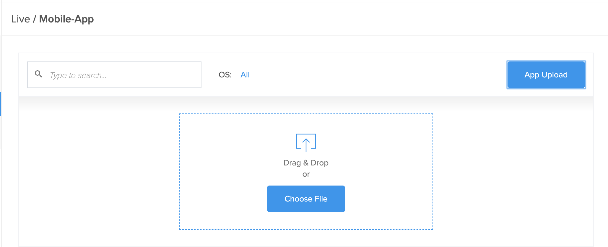

import Tabs from '@theme/Tabs';
import TabItem from '@theme/TabItem';

When testing mobile applications, you now have the option to upload your application to our new temporary application storage. Application storage is quite different and more flexible than our previous iteration (Sauce Storage) in multiple ways:

* Upload all your apps to the same location for cross-device automated and live testing with both virtual or real devices.
* Share your uploaded apps between your Extended Team Management (xTM) team members.
* Apps live in the new application storage for 60 days rather than 7 days in the old Sauce Storage.

## What You'll Need

* A Sauce Labs Account.
* A mobile app/binary file you wish to test. If you don't have one, you can use the [Sauce Labs sample mobile app](https://github.com/saucelabs/sample-app-mobile).

## Upload an App with App-Upload

1. Log in to Sauce Labs and select __LIVE__ from the options in the left-hand navigation.
2. Select __Mobile-App__.
3. You will see a list of previously uploaded apps.
4. To the right of the page, select __App-Upload__ to upload a new application (Note: Live Testing on Real Devices only at the moment):
    


5. You can either drag and drop and application, or browse for the file (*.APK or *.IPA format):   
   


6. To use an app you've previously uploaded, select "Check out the __old repository__" link at the bottom of the page. This will re-direct you to the legacy App Management UI with all your previously uploaded apps:
   

### Delete Apps with the Delete Button

The __Delete__ button will delete a whole application (e.g. a group of builds belonging to the same app package). 

Files associated with app identifiers i.e. belong to the same platform and are accessible to the same team, are indicated by the __+__ symbol next to version number. Also, the version number shown is the most recently updated file, not necessarily the 'latest' version of the application.
   


## Upload an App/File with the REST API

Below are some examples of how to use the Sauce Labs REST API to upload your mobile application or binary file to Sauce Application Storage. If you do not have an app to test this functionality, consider using the [Sauce Labs Swag Labs sample app](https://github.com/saucelabs/sample-app-mobile) for validating your account, as well as your tests' functionality.

### REST API Authentication

The APIs and authorization credentials are located here: [app.saucelabs.com](https://app.saucelabs.com)

A recommended best practice is to set your credentials as environment variables like so:

```bash
SAUCE_USERNAME='valid.username'
SAUCE_ACCESS_KEY='valid.key'
```

For specific instructions on how to set environment variables visit, the following links:

* [Set Environment Variables with Windows 10](https://www.architectryan.com/2018/08/31/how-to-change-environment-variables-on-windows-10/)
* [Set Environment Variables with MacOS](https://apple.stackexchange.com/questions/106778/how-do-i-set-environment-variables-on-os-x)
* [Set Environment Variables with Linux](https://askubuntu.com/questions/58814/how-do-i-add-environment-variables)

### Extended Team Management Sync

App Storage uses an XTM (Extended Team Management) sync feature which allows for user permissions schemes. In other words, a Sauce Labs admin (either an org admin or a team admin) can control access to individual application files or specific binary/script files. 

By default, all uploaded files are shared with the same team where the user participates currently. You, as a user, can only access files that are shared with the team where you contribute/participate unless your role is an organization admin in which case you have access to all files in your particular organization.

To manage access to your organization go to Account > Team Management.

### Storage API Endpoints

There are two main contexts/branches for the storage API:

* one for working with separate application builds (individual builds, application files, etc.).
* one for working with apps (groups of application builds with the same unique identifier, belonging to the same platform and team).

For more detailed information visit the Storage API Reference Page

#### Upload API Example

__US Data Center__
```bash
$ curl -F 'payload=@/Users/<user-name>/Downloads/<file_name>.apk' -F name=<file_name>.apk -u "$SAUCE_USERNAME:$SAUCE_ACCESS_KEY"  'https://api.us-west-1.saucelabs.com/v1/storage/upload'
```

__EU Data Center__
```bash
$ curl -F 'payload=@/Users/<user-name>/Downloads/<file_name>.ipa' -F name=<file_name>.ipa -u "$SAUCE_USERNAME:$SAUCE_ACCESS_KEY"  'https://api.eu-central-1.saucelabs.com/v1/storage/upload'
```

## Using Storage with Automated Test Builds

In the past, you had the option of using [Sauce Storage](https://wiki.saucelabs.com/display/DOCSDEV/Uploading+your+Application+to+Sauce+Storage) to retrieve your apps to use in automated tests. Now after successfully uploading your file to application storage, you can reference the __unique app identifier__ in your test code to retrieve and us the app for automated tests.

### Retrieving the Unique App Identifier

In order to use the applications in storage for your automated tests, you need to retrieve the unique app Identifier (`file_id`). For example, let's assume after you've updated a new version of your app using the `/upload` endpoint and the JSON response is something like below: 

```
{
   "item":{
      "id":"379c301a-199c-4b40-ad45-4a95e5f30a3a",
      "owner":{
         "id":"286c0fbb0cb644c4a012d505b8a0a1ac",
         "org_id":"c064890612424e34a12fca98ce4f32c6"
      },
      "name":"Android.SauceLabs.Mobile.Sample.app.2.3.0.apk",
      "upload_timestamp":1593450387,
      "etag":"0cf189b1c4c17a56656ada5e2d75cd51",
      "kind":"android",
      "group_id":2807,
      "metadata":{
         "identifier":"com.swaglabsmobileapp",
         "name":"Swag Labs Mobile App",
         "version":"2.3.0",
         "icon":"<long-serial-number>",
         "version_code":13,
         "min_sdk":16,
         "target_sdk":28
      }
   }
}

```

Then the `file_id` would be  `"id":"379c301a-199c-4b40-ad45-4a95e5f30a3a"`. If you're unsure of the `id` of an existing app, you can use the `/files` endpoint , along with the necessary parameters to find the desired application.

### Updating WebDriver Capabilities

If you were previously using application stored in `sauce-storage`, you can convert your existing test capabilities by replacing `sauce-storage:myapp` with `storage:<file_id>`.

#### Example Code Snippets

> The following examples assume that `file_id` = `c8511dd6-38ec-4f58-b8b9-4ec8c23ad882`

<Tabs defaultValue="java"
  values={[
    { label: 'Java', value: 'java', },
    { label: 'Node.js', value: 'js', },
    { label: 'Python', value: 'py', },
    { label: 'Ruby', value: 'ruby', },
    { label: 'C#', value: 'c', },
  ]}>

<TabItem value="java">

```java
caps.setCapability("app", "storage:c8511dd6-38ec-4f58-b8b9-4ec8c23ad882");
```

</TabItem>
<TabItem value="js">

```js
caps['app'] = 'storage:c8511dd6-38ec-4f58-b8b9-4ec8c23ad882';
```

</TabItem>
<TabItem value="py">

```python
caps['app'] = "storage:c8511dd6-38ec-4f58-b8b9-4ec8c23ad882"
```

</TabItem>
<TabItem value="ruby">

```ruby
caps['app'] = 'storage:c8511dd6-38ec-4f58-b8b9-4ec8c23ad882'
```

</TabItem>
<TabItem value="c">

```c
caps.SetCapability("app","storage:c8511dd6-38ec-4f58-b8b9-4ec8c23ad882");
```

</TabItem>
</Tabs>